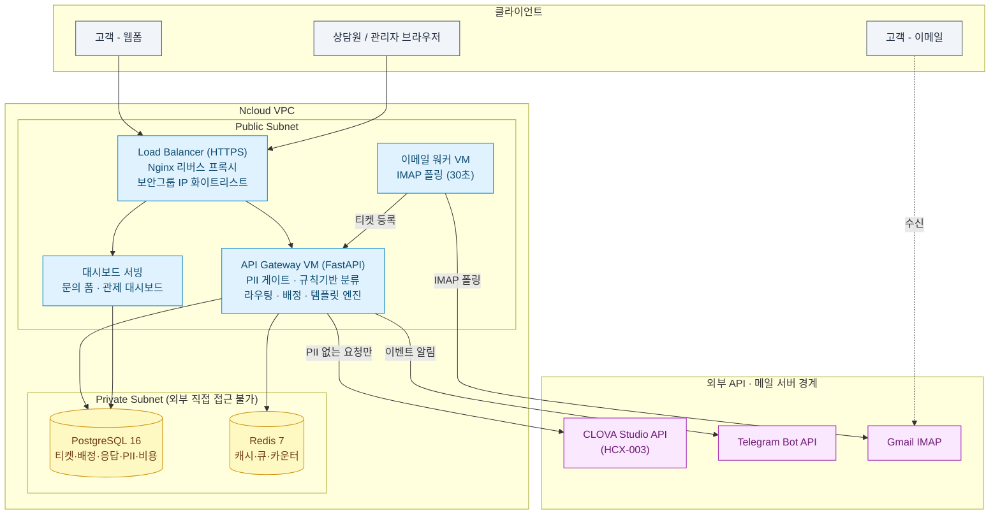
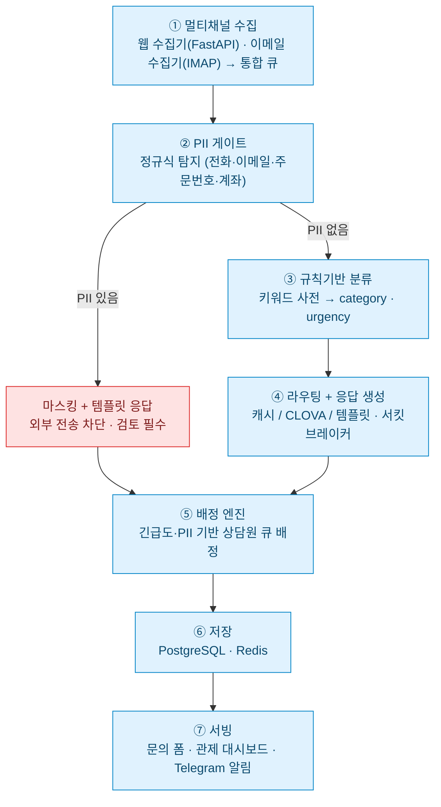
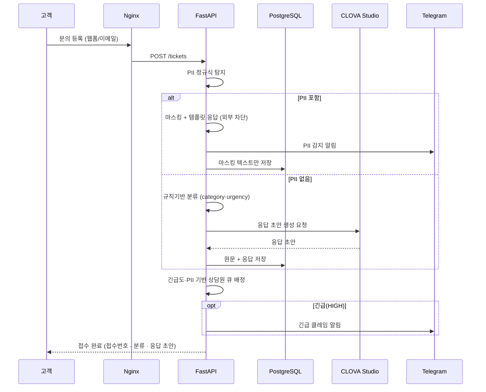
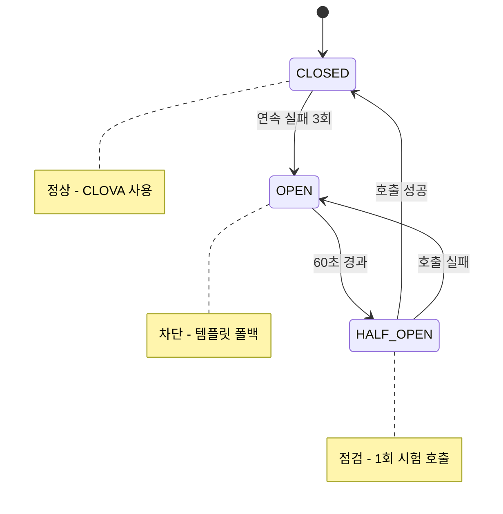

# 아키텍처 도식

> GitHub에서 아래 Mermaid 다이어그램이 그대로 렌더링됩니다.
> PPT에 넣을 때는 [mermaid.live](https://mermaid.live) 에 코드를 붙여넣어 PNG/SVG로 내보내면 됩니다.

---

## 1. 하드웨어(인프라) 아키텍처

Ncloud VPC를 Public / Private Subnet으로 분리하고, 데이터 계층(DB·Redis)을 외부에서
직접 접근할 수 없도록 Private Subnet에 격리한 3구역 구조.

---

## 2. 소프트웨어 아키텍처 (7계층)

문의 1건이 수집부터 서빙까지 거치는 처리 파이프라인.

---

## 3. 요청 처리 흐름 (시퀀스)

일반 문의(PII 없음)와 개인정보 포함 문의의 분기를 한눈에.

---

## 4. 서킷브레이커 상태 전이

CLOVA 장애 시 자동 차단·복구 흐름.

